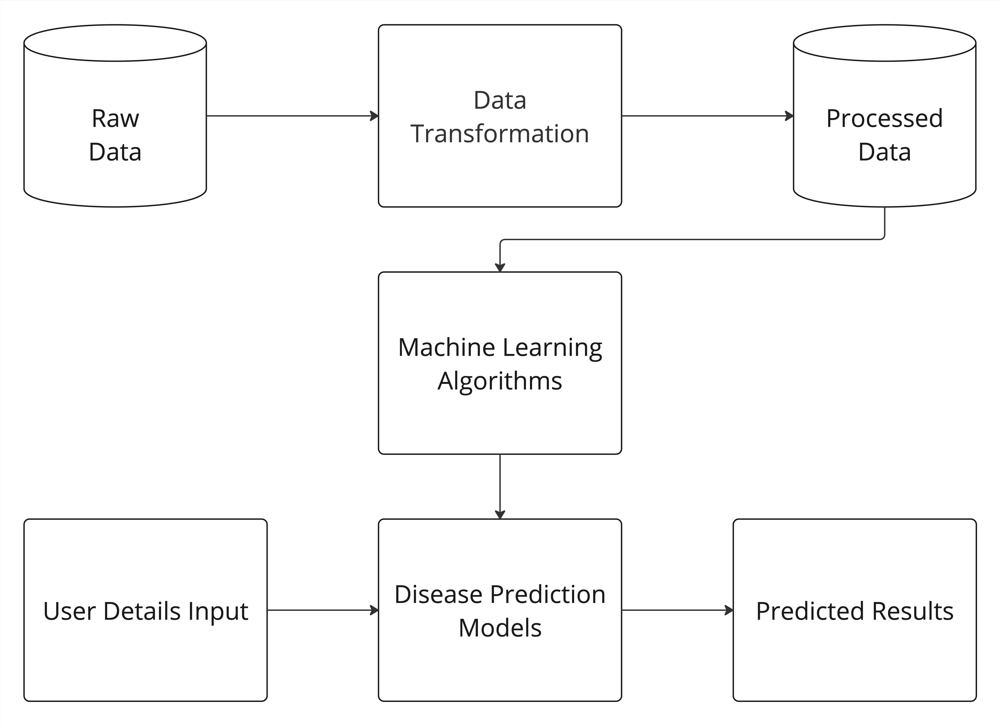
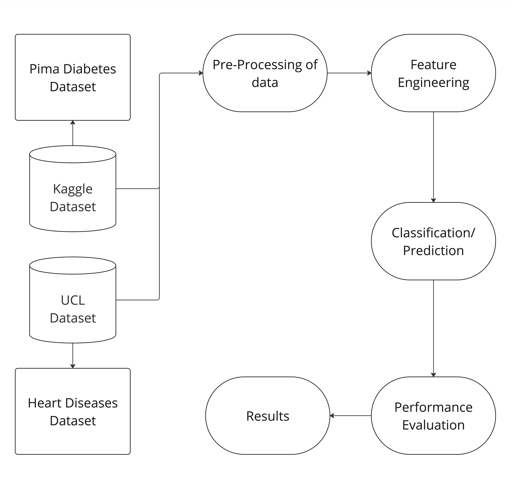

# Heart Disease and Diabetes Prediction with Machine Learning

## Abstract
 Heart disease and diabetes are among the
leading causes of morbidity and mortality worldwide, pos-
ing significant challenges to global healthcare systems.
The increasing availability of electronic medical data has
paved the way for leveraging machine learning techniques
to enhance disease prediction and diagnosis. In this study,
we propose a comprehensive framework for predicting dia-
betes and heart disease using advanced machine learning
algorithms. By employing a structured data science work-
flow, we perform extensive exploratory data analysis, data
preprocessing, and feature engineering on publicly avail-
able datasets. Our approach incorporates multiple classifi-
cation models, including K-Nearest Neighbors, Logistic Re-
gression, Random Forest, and Neural Networks, alongside
ensemble methods such as hard and soft voting to opti-
mize prediction accuracy. Rigorous hyperparameter tuning
and cross-validation ensure robust model performance.
We evaluate the models using metrics such as ROC-AUC
scores, confusion matrices, and cross-validated classifica-
tion reports. Additionally, feature importance analysis re-
veals key contributors to disease prediction, offering valu-
able insights for healthcare professionals. This research
demonstrates the potential of machine learning to predict
diabetes and heart disease with high accuracy, aiding early
diagnosis and informed medical decision-making

## Index Terms
- Heart disease
- Diabetes
- Machine learning
- Classification models
- Feature engineering
- Prediction
- Healthcare

---

## Project Structure

The project follows a standard data science file structure:

```plaintext
DATA-MINING
├── data
│   ├── processed
│   │   ├── diabetes.csv
│   │   └── heart_cleveland_upload.csv
│   └── raw
├── models
├── notebooks
│   ├── diabetes.ipynb
│   ├── executed_diabetes.ipynb
│   ├── heart_disease.ipynb
│   └── executed_heart_disease.ipynb
├── reports
│   ├── figures
│   │   ├── System_Architecture.png
│   │   └── Dataset_Handling.png
│   └── Data_Mining.pdf
├── src
│   ├── data
│   │   ├── __init__.py
│   │   └── data_loader.py
│   ├── features
│   │   ├── __init__.py
│   │   └── feature_engineering.py
│   ├── models
│   │   ├── __init__.py
│   │   ├── evaluation.py
│   │   └── model_factory.py
│   └── visualization
│       ├── config.py
│       ├── main.py
│       └── utils.py
├── tests
├── .gitignore
├── environment.yml
├── README.md
└── requirements.txt
```

---

## Getting Started

### Prerequisites

- Install dependencies using `pip` or `conda`:

```bash
pip install -r requirements.txt
```

OR

```bash
conda env create -f environment.yml
conda activate <your_environment_name>
```

---

### Running the Project

1. **To execute all notebooks:**

```bash
python -m src.main --run-notebooks
```

This will programmatically execute all Jupyter notebooks in the `notebooks` directory and save the executed versions.

2. **To run a specific dataset and model:**

```bash
python -m src.main --dataset <dataset_name> --model <model_name>
```

Examples:

- For heart disease prediction using Logistic Regression:

```bash
python -m src.main --dataset heart --model logistic_regression
```

- For diabetes prediction using Random Forest:

```bash
python -m src.main --dataset diabetes --model random_forest
```

---

## System Architecture



---

## Dataset Handling



---

## Results

- **Heart Disease Prediction:** Achieved high accuracy with Random Forest and Neural Networks.
- **Diabetes Prediction:** Ensemble methods provided improved prediction consistency.
- **Feature Importance Analysis:** Identified key predictors for both diseases, aiding medical decision-making.

---

## Future Work

- Extend the framework to other chronic diseases.
- Integrate deep learning models for improved prediction accuracy.
- Explore real-time deployment for clinical use.

---
